  <picture>
    <source media="(prefers-color-scheme: dark)" srcset="dark.svg">
    <source media="(prefers-color-scheme: light)" srcset="light.svg">
    
  </picture>

<a href="https://github.com/zerotwo5">
  <picture>
    <source media="(prefers-color-scheme: dark)" srcset="https://cdn.simpleicons.org/github/F8FAFC">
    
  </picture>
</a>
&nbsp;&nbsp;&nbsp;

&nbsp;&nbsp;&nbsp;

&nbsp;&nbsp;&nbsp;

  

<!--
Generated INSIDE your own repo by update-stats.yml, so it doesn't
depend on any third-party server. The #gh-dark-mode-only /
#gh-light-mode-only suffixes make GitHub show only the matching one
for the viewer's theme (same trick GitHub itself documents).
-->

